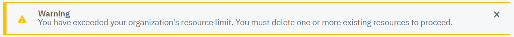
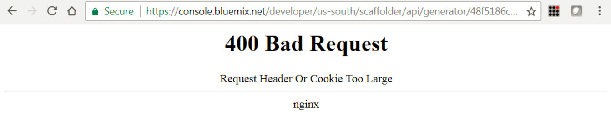

---

copyright:
  years: 2018
lastupdated: "2018-03-16"

---

{:new_window: target="_blank"}
{:shortdesc: .shortdesc}
{:screen: .screen}
{:codeblock: .codeblock}
{:pre: .pre}

# Getting started with {{site.data.keyword.cloud_notm}} {{site.data.keyword.hsplatform}}

{{site.data.keyword.cloud}} {{site.data.keyword.hsplatform}} ({{site.data.keyword.hsplatform}} for short) ensures that your iOS applications and data are in a highly-protected environment in {{site.data.keyword.cloud_notm}}.
{:shortdesc}

{{site.data.keyword.hsplatform}} offers you an iOS starter kit and a server-side starter kit in {{site.data.keyword.cloud_notm}}, which both simplify your steps to set up a secure development environment. A starter kit provides you the development evironment with the development language, the framework, and the architecture pattern.
- iOS starter kits  
The **MBaas with IBM Hyper Protect Services** starter kit is an iOS starter kit that hosts Hyper Protect services for your application in a Mobile Backend as a Service (MBaaS) platform.
- Server-side starter kit  
The **Backend for IBM Hyper Protect Services** starter kit is a server-side starter kit that hosts additional services for your application with a Backend For Frontend (BFF) architecture pattern. The BFF pattern can provide additional composition and control over the services and can add backend logic for the application. For more information about the differences between MBaaS and BFF, see [MBaaS vs. Backend Components](https://console.bluemix.net/docs/swift/backend/mbaas.html){:new_window}.

When you start to develop your iOS applications with these starter kits, you can benefit from a set of Hyper Protect services, including {{site.data.keyword.cloud_notm}} Hyper Protect DBaaS, {{site.data.keyword.cloud_notm}} {{site.data.keyword.hscrypto}}, {{site.data.keyword.cloud_notm}} {{site.data.keyword.keymanagementserviceshort}}, and {{site.data.keyword.cloud_notm}} {{site.data.keyword.hscontainers}}.  {{site.data.keyword.hsplatform}} integrates these services and binds them together to protect not only your application, but also all your data at rest, in use, or in flight. For more information about these Hyper Protect services, see [About Hyper Protect services](about_hp_services.html).

This getting started tutorial introduces the prerequisites and steps you need to follow to set up a Hyper Protect development environment and deploy your application in {{site.data.keyword.cloud_notm}}.

## Before you begin
{: #prerequisites}

You need to have an {{site.data.keyword.cloud_notm}} account before you can use {{site.data.keyword.hsplatform}}. If you don't have an {{site.data.keyword.cloud_notm}} account, [sign up and create one](https://www.ibm.com/account/us-en/signup/register.html).

Ensure that you install the following dependencies:
- [iOS 9.0 or later](https://support.apple.com/downloads/ios){:new_window}
- [Xcode 9.0](https://developer.apple.com/xcode/){:new_window}
- [Swift 4.0 or later](https://swift.org/download/#releases){:new_window}
- [Node.js](https://nodejs.org/en/download/){:new_window}
- [{{site.data.keyword.cloud_notm}} Developer Tools](https://www.ibm.com/cloud/cli){:new_window}
- [Docker engine](https://www.docker.com/docker-mac){:new_window}
- [CocoaPods for IBM Cloud SDKs](https://cocoapods.org/){:new_window}

For more information about requirements for Swift development on {{site.data.keyword.cloud_notm}}, see [Requirements](https://console.bluemix.net/docs/swift/getting_started/set_up.html){:new_window}.

## Developing with **MBaas with IBM Hyper Protect Services**
{: #frontend}

This iOS starter kit pre-configures a MBaaS environment for your application development with addtional Hyper Protect services. You can start to develop your applications in a more secure environment with the integration of a set of {{site.data.keyword.cloud_notm}} services. You can benefit from Mobile Analytics, Push Notifications, and {{site.data.keyword.hscrypto}}.

1. Log in to the [{{site.data.keyword.cloud_notm}} Developer Console for Apple](https://console.bluemix.net/developer/appledevelopment/dashboard) with your {{site.data.keyword.cloud_notm}} account.
<!--2. Click **Starter Kits** from the left navigator.-->
3. Choose and click the **MBaas with IBM Hyper Protect Services** starter kit. You can see the overview of the starter kit including the services that the starter kit pre-configures. Click **Create project**.
4. Choose the Cloud Foundry region, organization, and space where you want to store your project, and pricing plans for pre-configured services. Then, click **Create Project**.
    The starter kit automatically adds the service **Push Notification**, **{{site.data.keyword.hscrypto}}**, and **Mobile Analytics** to your project. You can click the "Documentation" links after the service name to learn more about these services.
    You can also see the credentials of your project.
5. Click **Download Code** on the top right to generate the archive of the initial project code. Save the archive file to your local machine.
6. Extract the archive file that you download.
7. Open a terminal window, navigate to the extracted folder, and execute `pod install` to install and configure {{site.data.keyword.cloud_notm}} Mobile services Dependency Management. <!--After the execution completes, you can see the reminder to close any Xcode sessions and start to use the `.xcworkspace`.-->
8. In your Finder, open the extracted folder and double-click the `.xcworkspace` file. An Xcode window opens.
9. In the Xcode window, click the **Run** button from the menu bar. Your project code is loaded in Xcode and a simulator opens.
10. In the Xcode window, open the **MBaaSwithIBMHyperProtectServicesxxxxx** folder on the left panel, where **xxxxx** is the project name suffix.
11. Write code to implement your application logic and test it in Xcode locally. When your application is ready, you can deploy it to {{site.data.keyword.cloud_notm}}. For more information, see [Deploying an application](#eploy).

## Developing with **Backend for IBM Hyper Protect Services**
{: #backend}

This BFF starter kit provides you the Swift development language and the Kitura framwork. It enables you to define additional backend logic in Swift.

1. Log in to the [{{site.data.keyword.cloud_notm}} Developer Console for Apple](https://console.bluemix.net/developer/appledevelopment/dashboard) with your {{site.data.keyword.cloud_notm}} account.
2. Click **Starter Kits** from the left navigator.
3. Choose and click the **Backend for IBM Hyper Protect Services** starter kit. You can see the overview of the starter kit. Click **Create project**.
4. Choose the Cloud Foundry region, organization, and space where you want to store your project. Then, click **Create Project**.
5. Add HyperSecure DBaaS to your project.
    1. Click **Add Resource**.
    2. Choose **Data** and click **Next**.
    3. Choose **HyperSecure DBaaS** and click **Next**.
    4. Specify the cluster name, admin name, and password for your database and click **Create**. Ensure that you have a strong password that includes numbers, mixed upper and lower case characters and symbols. Wait for a while when the starter kit provisions HyperSecure DBaaS instance. Note that HyperSecure DBaaS is a member of the {{site.data.keyword.cloud_notm}} Hyper Protect Services family and the name "HyperSecure DBaaS" will change shortly.  
    **Tip**: If you get a resource limit warning as below, check all your Cloud Foundry organizations and spaces and delete any other running services.  
    
6. Click **Download Code** on the top right to generate the archive of the initial project code. Save the archive file to your local machine.  
    **Tip**: If you get a 404 bad request as below, clear you cookies and cached data in your browser, and then try again.  
      
7. Extract the archive file that you download.
8. Open a terminal window, navigate to the extracted folder, and execute `swift package generate-xcodeproj` to generate XCode project for the Swift code.
9. In your Finder, open the README.md file and scroll down to the **Run** section. Execute the following command and script in your terminal window.
    1. Execute `swift build -Xlinker -lc++` to build the application. Enter `n` if you are reminded to correct `build` to `.build`.
    2. Execute the `.build/debug/BackendforIBMHyperProtectServicesyyyyy` script where **yyyyy** is your project name suffix. Click **Allow** if you are asked whether your application accepts incoming network connections. <!--For more information about this script, see [How it works](how_it_works.html).-->
    After the execution completes, you can visit `localhost:8080/explorer` in your web browser to see the APIs.
10. Write code to implement your application logic and test it in Xcode locally. When your application is ready, you can deploy it to {{site.data.keyword.cloud_notm}}. For more information, see [Deploying an application](#eploy).

## Developing with both starter kits
{: #dev-starter-kits}

You can use both **MBaas with IBM Hyper Protect Services** (referenced as **frontend** below) and **Backend for IBM Hyper Protect Services** (referenced as **backend** below) starter kits to secure the lifecycle of your application and data.

1. Follow steps in [Developing with MBaas with IBM Hyper Protect Services](index.html#frontend) and [Developing with Backend for IBM Hyper Protect Services](index.html#backend) to download and configure both starter kits in your local machine.
2. In your Finder, open the extracted folder for backend, extract the `BackendforIBMHyperProtectServicesyyyyy_iOS_SDK.zip` file, where **yyyyy** is your backend project name suffix.
3. Open the **Source** folder in the extracted **BackendforIBMHyperProtectServicesyyyyy_iOS_SDK** folder.
4. Select all folders and files in the **Source** folder, drag and drop them into the **MBaaSwithIBMHyperProtectServicesxxxxx** folder in the Xcode window. Ensure that you select **Create groups** for added folders in the pop-up option window and click **Finish**.
5. In your Finder, open the **Docs** folder in the extracted **BackendforIBMHyperProtectServicesyyyyy_iOS_SDK** folder and double-click to open the `README.html` file.
6. Scroll down the README.html page and find the **getAll** API call. Copy the example in the **getAll** API call and paste it in the **viewDidLoad()** function of the `ViewController.swift` file in the Xcode window. See the example below. You can find the `ViewController.swift` in the **MBaaSwithIBMHyperProtectServicesxxxxx** folder in the Xcode window.

    ")
7. Write code to implement your application logic and test it in Xcode locally. When your application is ready, you can deploy it to {{site.data.keyword.cloud_notm}}. For more information, see [Deploying an application](#eploy).

## Deploying an application
{: #deploy}

The {{site.data.keyword.hsplatform}} starter kits enable you to deploy your application to {{site.data.keyword.cloud_notm}} through an easy-to-use UI.

Before you begin, you need to create a Kubernetes cluster with [{{site.data.keyword.cloud_notm}} Container Service](https://console-dal10.bluemix.net/containers-kubernetes/clusters) as a worker node to host your application.

1. In the [{{site.data.keyword.cloud_notm}} Developer Projects dashboard](https://console.bluemix.net/developer/appledevelopment/projects), click **Projects** in the left navigator.
2. Click and open your backend project, that is, **BackendforIBMHyperProtectServicesyyyyy**.
3. Click **Deploy to cloud**. Choose to deploy your application in a Kubernetes cluster. Choose the cluster that you want to use from the dropdown list. Click **Create**. The deployment creates a Git repository and stores your generated code. It also creates a DevOps toolchain that includes creating and managing issues in Git, viewing generated code in Git, accessing an Eclipse-base Web IDE, and viewing the delivery pipeline. In the delivery pipeline, you can kick off builds, manage deployment and view logs and history.
4. Click **View Toolchain** and click **Git**.
5. Push your application code to Git. You changes in Git automatically triggers build in the delivery pipeline. You can click **Delivery Pipeline** in Toolchain page to see the delivery status.

Now your application is successfully deployed to {{site.data.keyword.cloud_notm}}.

You can also use command line interfaces (CLIs) to deploy your applications to {{site.data.keyword.cloud_notm}}. For more information, see [Deploying apps with the CLI](https://console.bluemix.net/docs/containers/cs_app.html#app_cli).

After you deploy your application to {{site.data.keyword.cloud_notm}}, you will get an URL from the UI or CLI.  You can use this URL to access the backend server.

**Note**: If you expect dedicated security support and deploy your application to the {{site.data.keyword.hscontainers}} cluster, register as sponsor users with the [IBM Z Client Feedback Program](https://www-01.ibm.com/marketing/iwm/iwmdocs/web/cc/earlyprograms/zcustomer.shtml).
