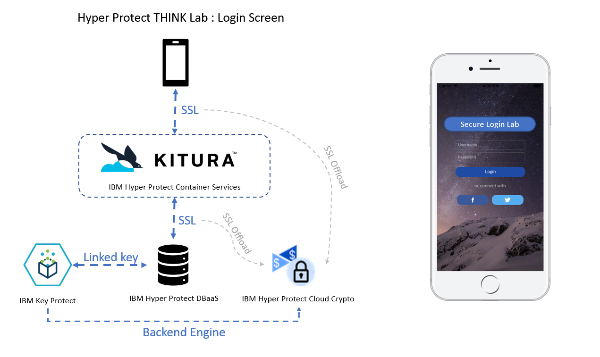

---

copyright:
  years: 2018
lastupdated: "2018-03-08"

---

{:new_window: target="_blank"}
{:shortdesc: .shortdesc}
{:screen: .screen}
{:codeblock: .codeblock}
{:pre: .pre}

# Sample iOS application

{{site.data.keyword.cloud}} {{site.data.keyword.hsplatform}} serves as the backend of your iOS application and integrates a set of Hyper Protect services to protect your application and data that is at rest, in use, and in flight. The sample iOS application below shows the end-to-end process that how your application and data are protected in a hyper secure evironment.
  

1. The **Secure Login Lab** iOS app opens a login dialog immediately after it is launched. When a user enters a user name and a password, the user name and password are sent to a Kitura app, which is the backend for the iOS app.
2. The Kitura app, which is running in {{site.data.keyword.cloud_notm}} {{site.data.keyword.hsplatform}}, validates the user name and password. 
3. If the user name and password are valid, the Kitura app asks Key Protect to generate a key pair, that is, the key encryption key (KEK) and data encryption key (DEK). If the user name and pasword are invalid, the Kitura app returns an error message to the iOS app.
4. Key Protect passes the KEK/DEK key pair to the Kitura app and the Kitura app sends the KEY back to the iOS app.
5. The Kitura app asks {{site.data.keyword.hscrypto}} to use the DEK to encrypt the data that is read from Hyper Protect DBaaS that stores the data.
6. {{site.data.keyword.hscrypto}} returns encrypted data to the Kitura app. The Kitura app sends the encrypted data to the iOS app through SSL. This SSL offloading approach increases the effectiveness of the security that the certificates offer.
7. The iOS app decrypts the data by using the KEK, and then user can check the decrypted data on the iOS app.

